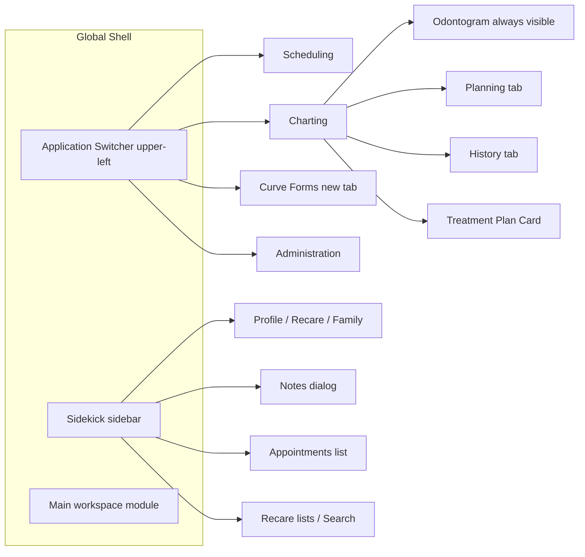
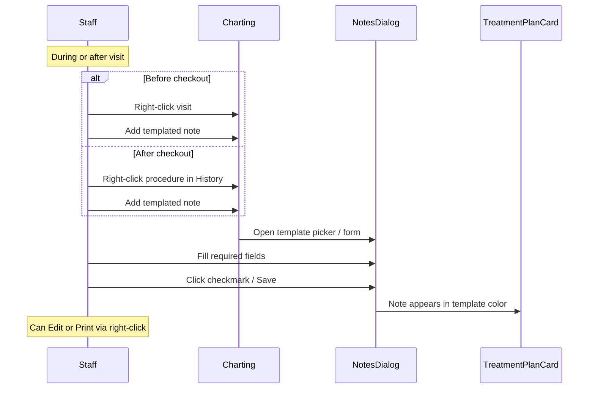
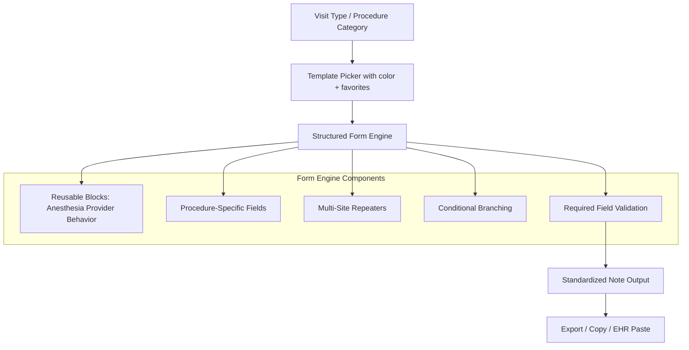

# Curve Hero Clinical Notes — Benchmark Research & Implementation Reference

A single reference for benchmarking and building a dental notes standardization app against **Curve Hero** templated notes. Synthesized from public Curve Dental documentation (Zendesk help center, product pages, permissions guides). Curve Hero is a cloud-native, browser-based dental PMS; clinical documentation is **appointment-type-driven**, **form-builder-based**, and **tightly integrated** with scheduling, charting, and billing.

---

## Part A — Curve Hero Reference (How It Works)

### 1. Platform Context

| Attribute | Detail |
|-----------|--------|
| Product | **Curve Hero** (base tier PMS by Curve Dental) |
| Architecture | Cloud-native, browser-based, no local server |
| Core UI pattern | Persistent **Sidekick** sidebar + main workspace modules |
| Related apps | **Curve Forms** (template builder, opens in new tab), **Curve GRO** (patient engagement), **Curve Care+** (ambient AI: Notes+, Charting+, Perio+) |
| Legacy vs modern notes | **QuickText** (older free-text snippet system) coexists with **Templated Notes** (structured forms in Curve Forms). Docs suggest reviewing QuickText when migrating to templated notes |

### 2. Application Layout & Navigation



**Sidekick (persistent left column)**
- Always-visible patient context panel; editable without leaving current module
- Tabs: **Patient**, **Search**, recare lists
- Expandable sections: Profile, Recare, phone, appointments
- **Notes** opens Notes dialog (`Add Templated Note`, favorites, tags)
- Drag-and-drop: recare tags and patients onto scheduler

**Charting module**
- **Odontogram** always visible alongside treatment plan
- **Planning tab**: future treatment; shortcut buttons populate procedure groups
- **History tab**: completed procedures sorted by code, provider, date, clinic
- **Treatment Plan Card**: visit groupings; templated notes attach here
- Two-step charting: select tooth → select procedure (or shortcut button for bundled procedures)

**Curve Forms (admin/builder — separate tab)**
- Sidebar: **Note Templates** icon
- Sub-modules: **Questions** | **Templates**
- Split-pane: left = Template menu (Tool Box + Question categories), right = Question/Template Builder (drag-and-drop)

### 3. Color-Coded Appointment-Type System

Curve Hero notes mirror a **four-way naming/color convention**:

| Element | Purpose | Admin location |
|---------|---------|----------------|
| **Appointment / Recare Tags** | Schedule color, auto-populate CDT codes | Administration → Scheduling |
| **Charting Shortcut Buttons** | One-click treatment plan with full procedure bundle | Administration → Charting shortcuts |
| **Note Templates** | Structured clinical documentation per visit type | Curve Forms → Templates |
| **Consent Forms** | Patient signatures matching visit type | Curve Forms |

**Rule**: Same name + same color across all four (e.g. "Crown Prep" tag, shortcut, note template, consent form).

**Design takeaway**: Users map **appointment type → color → template**. Key navigation off **visit/procedure category**, not free-form note creation.

### 4. Clinical Documentation Systems

**A. QuickText (legacy)**
- Free-text snippet macros; permission `Create / Edit / Delete QuickText`
- Inspiration source when building templated questions; being superseded

**B. Templated Notes (current)**
- Built in Curve Forms; used in Charting and Notes module
- `Use Templated Notes`: fill, favorite, tag, save
- `Edit Templated Notes`: build/edit in Curve Forms
- Required fields = red asterisk; **cannot save** until complete
- Completed notes show in **template color** on Treatment Plan Card
- **Favorites** and **custom note tags** (Clinical, Perio, Billing, etc.)

**C. AI-Assisted Notes (Curve Care+ / Curve AI)**
- **Notes+**: ambient voice → templated or SOAP note; provider reviews before save
- **Curve AI Templated Notes**: template + transcript → auto-fill → human review → save
- **Curve AI SOAP Notes**: transcript → SOAP text in free-form editor
- Entry: Sidekick → Notes → Add Templated Note → transcript → Complete with Curve AI
- Human-in-the-loop: AI assists, never auto-finalizes

### 5. Note Creation Workflow (Chairside)



**Other entry points**: Sidekick → Notes → Add Templated Note (optional AI); Charting History linked to date of service.

**Timing**: Pre-checkout (ideal) or post-checkout (retroactive).

### 6. Questions vs Templates (Curve Forms)

| Concept | Questions | Templates |
|---------|-----------|-----------|
| Purpose | Reusable building blocks | Appointment-type note forms |
| Scope | Shared across templates | One per visit type |
| Organization | Question Categories | Template Categories |
| Reuse | Drag into Template Builder | Template-only fields stay local |

**Principle**: Build **Questions first** for reuse (Anesthesia, Provider, Behavior); template-specific fields only when not shared.

### 7. Form Component Toolbox

| Component | Input behavior | Common labels / use |
|-----------|---------------|---------------------|
| **Section Header** | Visual grouping | Procedure section headers |
| **Short Answer** | Single-line text | Site(s), Shade, Lab name, Original placement date, Due Date and Time |
| **Text box** | Multi-line text | Additional notes, reactions |
| **Dropdown** | Single-select | Material, Topical anesthesia, Performed, Lab |
| **Select Boxes** | Multi-select checkboxes | Procedures, Provider(s), Local anesthesia |
| **Checkbox** | Checkbox | Provider (lab template) |
| **Yes, No** | Radio binary | Build up done?, Replacement? |
| **Material** | Filterable material picker | Restorative materials |
| **Radiographs** | Imaging type picker | PA, FMX, Periapical |
| **Diagnosis Reason** | Diagnosis picker | Crown indications |
| **Excellent, Good, Fair, Poor** | 4-level scale | Home care, prognosis |
| **Mild, Moderate, Severe** | 3-level scale | Calculus |
| **Generalized, Localized** | Distribution picker | Bleeding gums |
| **Repeater** | Multiple rows | Multi-tooth fillings, crown lab entries |
| **Site** | Tooth/site selector | Inside repeaters and crown questions |
| **Conditional logic** | Show/hide fields | See Section 8 |

Per-field config: **Label**, **Answer** (options), **Required**, **Conditional**.

### 8. Conditional Logic

- **This component should display**: True/False
- **When the form component**: [parent field]
- **Has the value**: [answer]

| Trigger field | Trigger value | Revealed field |
|---------------|---------------|----------------|
| Replacement? | Yes | Original placement date |
| Lab where case was sent | Other | Lab name |
| Radiographs | Periapical | Site(s) |

### 9. Procedure-Specific Template Schemas

**Fillings**
- Repeater: site, surface, material per row
- Material dropdown: Composite, Amalgam, etc.
- Reusable: Anesthesia, Provider, Patient Behavior
- Additional notes text box

**Crowns**
- Site(s) (required), Build up done? (Yes/No), Material, Radiographs
- Replacement? (Yes/No), Diagnosis Reason
- Original placement date (conditional on Replacement=Yes)
- Reusable blocks + Additional notes

**Hygiene / recare**
- Performed: Adult prophy, Child prophy
- Home care (Excellent/Good/Fair/Poor), Radiographs (PA, FMX)
- Site(s) conditional on Periapical
- Calculus (Mild/Moderate/Severe)
- Bleeding gums: Generalized, Localized, No bleeding
- Additional notes

**Lab case (crown lab slip)**
- Lab dropdown (+ Other → Lab name)
- Repeater: Site + Shade per crown
- Material, Due Date and Time, Provider checkbox
- Extensible to dentures, retainers, bridges

**Anesthesia (reusable)**
- Topical: Dropdown (Benzocaine, Cetacaine, …)
- Local injected: Select Boxes (Septocaine, Lidocaine, …)
- Additional notes and reactions

**Provider (reusable)**
- Provider(s) for procedures — Select Boxes
- Optional hygienist Select Boxes

**Patient Behavior (reusable)**
- Cooperative / anxious / difficult options (office-customized)
- Optional conditional sub-questions

### 10. Dropdown & Variable Inventory

Office-configurable defaults from Curve documentation:

| Domain | Values |
|--------|--------|
| Restorative materials | Composite, Amalgam; crown materials via Material component |
| Topical anesthesia | Benzocaine, Cetacaine |
| Local injected | Septocaine, Lidocaine |
| Hygiene | Adult prophy, Child prophy |
| Radiographs | PA, FMX, Periapical |
| Home care / prognosis | Excellent, Good, Fair, Poor |
| Calculus | Mild, Moderate, Severe |
| Bleeding | Generalized, Localized, No bleeding |
| Crown booleans | Build up done?, Replacement? → Original placement date |
| Lab | Office lab list + Other; Shade; Due Date and Time |
| People | Provider names, Hygienist names (from practice staff) |
| Site | Site component or Short Answer "Site(s)"; multi via Repeater |
| Free text | Additional notes, Additional notes and reactions |

### 11. Permissions (Notes-Relevant)

| Permission | Capability |
|------------|------------|
| `Use Templated Notes` | Fill forms, favorites, tags, save |
| `Edit Templated Notes` | CRUD Questions/Templates in Curve Forms |
| `Create / Edit / Delete QuickText` | Legacy snippets |
| Custom note tags | Read/edit per tag type |
| `Lock Note` / `Unlock Note` | Finalization |

Separate **author** (builder) vs **clinician** (filler) roles.

### 12. Usability Lessons & Gaps

**Curve Hero strengths to benchmark**
1. Appointment-type-first navigation with color consistency
2. Structured fields over free-text for routine visits
3. Reusable question library (Anesthesia, Provider, Behavior)
4. Required field enforcement (hard block)
5. Favorites for speed
6. Repeaters for multi-tooth visits
7. Conditional progressive disclosure
8. Contextual entry from charting
9. AI requires human review before save
10. Notes on Treatment Plan Card, not buried

**Known gaps / opportunities**
1. Admin-heavy Curve Forms builder
2. QuickText + Templated Notes coexistence
3. Shallow anesthesia defaults (no technique/carpules/aspiration)
4. No native SOAP form fields (AI free text only)
5. Perio charting separate from note templates
6. Template-only components don’t reuse easily

### 13. Suggested App Architecture



### 14. Primary Sources

- [Setting Up Note Templates to Maximize Your Practice](https://curvedental.zendesk.com/hc/en-us/articles/50482636787603-Setting-Up-Note-Templates-to-Maximize-Your-Practice)
- [Creating a Note Template for Fillings](https://curvedental.zendesk.com/hc/en-us/articles/47872984972051-Creating-a-Note-Template-for-Fillings)
- [Building a Complex Question for Crowns](https://curvedental.zendesk.com/hc/en-us/articles/50379253026195-Building-a-Complex-Question-for-Crowns-for-Note-Templates)
- [Building a Complex Question for Hygiene](https://curvedental.zendesk.com/hc/en-us/articles/50513846776211-Building-a-Complex-Question-for-Hygiene-for-Note-Templates)
- [Creating a Note Template for Tracking Lab Cases](https://curvedental.zendesk.com/hc/en-us/articles/47876966528147-Creating-a-Note-Template-for-Tracking-Lab-Cases)
- [Building a Simple Question for Administered Anesthesia](https://curvedental.zendesk.com/hc/en-us/articles/50516863001235-Building-a-Simple-Question-for-Administered-Anesthesia)
- [Building a Simple Question for Providers](https://curvedental.zendesk.com/hc/en-us/articles/50517430128147-Building-a-Simple-Question-for-Providers)
- [Customizing Curve Hero Tools](https://curvedental.zendesk.com/hc/en-us/articles/50473862926611-Customizing-Curve-Hero-Tools-to-Maximize-Your-Practice)
- [Setting Up Charting Shortcut Buttons](https://curvedental.zendesk.com/hc/en-us/articles/50370770205075-Setting-Up-Charting-Shortcut-Buttons-to-Maximize-Your-Practice)
- [Curve Care+](https://www.curvedental.com/curve-care)
- [Curve Dental Charting Software](https://www.curvedental.com/dental-charting-software)

**Research limitation**: Public documentation only; no live Curve Hero UI. Office instances vary by customization.

---

## Part B — Dental Notes Standardizer (This Repo)

### Quick start

```bash
npm install
npm run dev    # http://localhost:5173
npm run build
```

### Implementation parity checklist

- [x] Visit-type template library (Fillings, Crown, Hygiene, Lab Case)
- [x] Reusable blocks: Anesthesia, Provider, Patient Behavior
- [x] Component types: dropdown, multi-select, yes/no, scales, site, repeater, free text
- [x] Required field validation before export
- [x] Conditional show/hide rules
- [x] Favorites and recently used templates
- [x] Multi-tooth repeater rows (Site + Material + Shade)
- [x] Additional notes on every template
- [x] Clinical fill UX (template picker + form + output)

### Workflow validation

| Curve Hero workflow | Implementation |
|---------------------|----------------|
| Visit-type-first navigation | Template picker with color badges |
| Color-coded templates | `color` on cards and form header |
| Favorites | localStorage star toggle |
| Recently used | localStorage last 5 |
| Reusable Questions | `src/data/reusableBlocks.ts` via `reusableBlockIds` |
| Required fields | Red asterisk; blocks Generate Note |
| Conditional fields | `conditional` rules on fields |
| Repeaters | Fillings and Lab Case templates |
| EHR paste | Copy to clipboard |

### Code map

| Area | Path |
|------|------|
| Types | `src/types/form.ts` |
| Reusable blocks | `src/data/reusableBlocks.ts` |
| Procedure templates | `src/data/templates/procedureTemplates.ts` |
| Form engine | `src/components/FormEngine/` |
| Template picker | `src/components/TemplatePicker.tsx` |
| Note output | `src/components/NoteOutput.tsx` |

### Out of scope (intentional)

- Curve Hero API / charting integration
- QuickText legacy
- AI transcript pre-fill
- Deep anesthesia fields (technique, carpules, aspiration)
- Live provider sync from practice database
- Admin template builder UI
