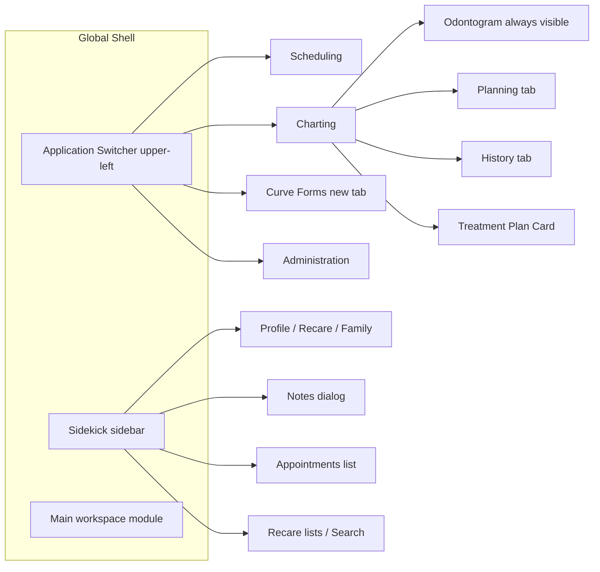
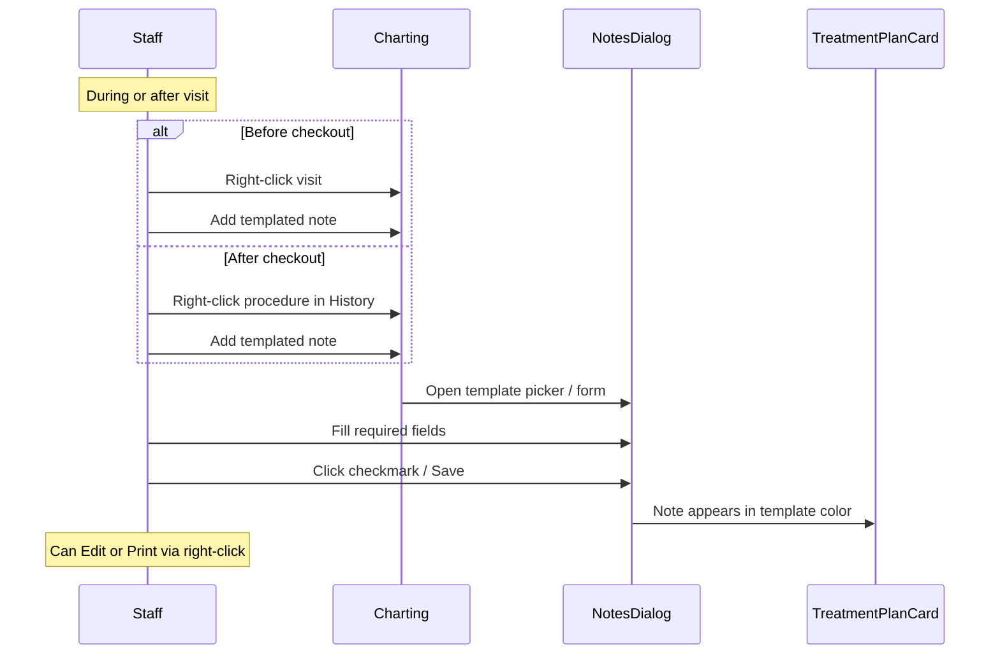
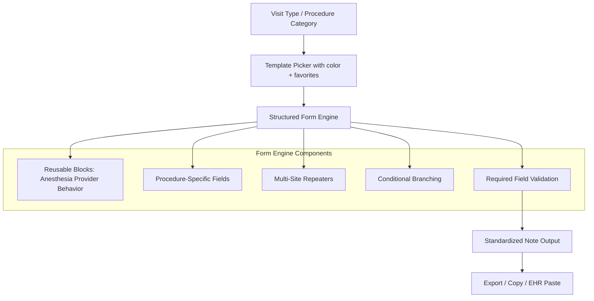

# Curve Hero Clinical Notes — Benchmark Research Summary

> **Document purpose:** Ingested reference for benchmarking a dental notes standardization app against Curve Hero templated notes.  
> **Sources:** Public Curve Dental documentation (Zendesk help center, product pages, permissions guides).  
> **Generated:** August 2026  
> **Research limitation:** No live Curve Hero UI access; office instances vary by customization.

Curve Hero is a cloud-native, browser-based dental PMS. Clinical documentation is **appointment-type-driven**, **form-builder-based**, and **tightly integrated** with scheduling, charting, and billing.

---

## Table of Contents

1. [Platform Context](#1-platform-context)
2. [Application Layout & Navigation](#2-application-layout--navigation)
3. [Color-Coded Appointment-Type System](#3-the-color-coded-appointment-type-system-critical-design-pattern)
4. [Clinical Documentation Systems](#4-clinical-documentation-systems-three-layers)
5. [Note Creation Workflow](#5-note-creation-workflow-chairside-ux)
6. [Questions vs Templates](#6-curve-forms-architecture-questions-vs-templates)
7. [Form Component Toolbox](#7-form-component-toolbox-field-types)
8. [Conditional Logic](#8-conditional-logic-pattern)
9. [Procedure-Specific Template Schemas](#9-procedure-specific-template-schemas-documented-defaults)
10. [Dropdown & Variable Inventory](#10-dropdown--variable-inventory-consolidated)
11. [Permissions Model](#11-permissions-model-notes-relevant)
12. [Usability Lessons & Gaps](#12-integration-points-your-app-should-mirror-usability-lessons)
13. [Suggested App Architecture](#13-suggested-mapping-to-your-notes-standardization-app)
14. [Primary Source References](#14-primary-source-references)
15. [Implementation Parity (Dental Notes Standardizer)](#15-implementation-parity-dental-notes-standardizer)

---

## 1. Platform Context

| Attribute | Detail |
|-----------|--------|
| Product | **Curve Hero** (base tier PMS by Curve Dental) |
| Architecture | Cloud-native, browser-based, no local server |
| Core UI pattern | Persistent **Sidekick** sidebar + main workspace modules |
| Related apps | **Curve Forms** (template builder, opens in new tab), **Curve GRO** (patient engagement), **Curve Care+** (ambient AI: Notes+, Charting+, Perio+) |
| Legacy vs modern notes | **QuickText** (older free-text snippet system) coexists with **Templated Notes** (structured forms in Curve Forms). Docs explicitly suggest reviewing QuickText when migrating to templated notes |

---

## 2. Application Layout & Navigation

### Sidekick (persistent left column)

- Always-visible patient context panel; editable without leaving current module
- Tabs include **Patient**, **Search**, recare lists
- Expandable sections: Profile, Recare, phone, appointments
- **Notes** opens a Notes dialog from Sidekick (`Add Templated Note`, favorites, tags)
- Drag-and-drop: recare tags and patient entries onto scheduler

### Charting module layout

- **Odontogram** permanently displayed alongside treatment plan (visual + table views)
- **Planning tab**: future treatment; shortcut buttons populate procedure groups
- **History tab**: completed procedures sorted by procedure code, provider, date, clinic
- **Treatment Plan Card**: visit groupings; templated notes attach here
- Two-step charting UX: select tooth → select procedure (or use shortcut button for bundled procedures)

### Curve Forms (admin/builder — separate tab)

- Sidebar: **Note Templates** icon
- Two sub-modules: **Questions** | **Templates**
- Split-pane builder:
  - Left: **Template menu** (Tool Box + Question categories)
  - Right: **Question Builder** or **Template Builder** (drag-and-drop canvas)

---

## 3. The Color-Coded Appointment-Type System (Critical Design Pattern)

Curve Hero's notes UX is not standalone—it mirrors a **four-way naming/color convention** across the practice:

| Element | Purpose | Admin location |
|---------|---------|----------------|
| **Appointment / Recare Tags** | Schedule color, auto-populate CDT codes on booking | Administration → Scheduling |
| **Charting Shortcut Buttons** | One-click treatment plan with full procedure bundle | Administration → Charting shortcuts |
| **Note Templates** | Structured clinical documentation per visit type | Curve Forms → Templates |
| **Consent Forms** | Patient signatures matching visit type | Curve Forms |

**Convention rule:** Same name + same color across all four. Example: a "Crown Prep" tag, shortcut button, note template, and consent form all share identical naming and color.

**Why this matters for your app:** Users mentally map **appointment type → color → template**. Your standardization app should key off **visit/procedure category** as the primary navigation axis, not free-form note creation.

---

## 4. Clinical Documentation Systems (Three Layers)

### A. QuickText (legacy)

- Free-text snippet macros
- Permission: `Create / Edit / Delete QuickText`
- Still referenced as inspiration when building new templated questions
- Less structured; being superseded by Templated Notes

### B. Templated Notes (current structured system)

- Built in **Curve Forms**, consumed in **Charting** and **Notes module**
- Permission to use: `Use Templated Notes` (fill, favorite, tag, save)
- Permission to build: `Edit Templated Notes`
- **Required fields** show red asterisk; note **cannot save** until complete
- Completed notes display in **template color** on Treatment Plan Card
- **Favorites list** for high-frequency templates
- Supports **custom note tags** (Clinical, Perio, Billing, etc.)

### C. AI-Assisted Notes (Curve Care+ / Curve AI)

- **Notes+**: ambient voice → templated or SOAP note; provider must review before save
- **Curve AI Templated Notes**: select template + appointment transcript → AI auto-fills fields → human review → save
- **Curve AI SOAP Notes**: transcript → organized SOAP text in free-form editor
- Workflow entry: Sidekick → Notes → Add Templated Note → select transcript → Complete with Curve AI
- Human-in-the-loop is explicit: AI assists, never auto-finalizes

---

## 5. Note Creation Workflow (Chairside UX)

**Alternative entry points:**

- Sidekick → **Notes** → Add Templated Note (with optional AI pre-fill)
- Charting History: notes linked to date of service

**Timing:** Notes can be added pre-checkout (ideal) or post-checkout (retroactive). Both paths exist intentionally.

---

## 6. Curve Forms Architecture: Questions vs Templates

| Concept | Questions | Templates |
|---------|-----------|-----------|
| Purpose | Reusable building blocks | Appointment-type note forms |
| Scope | Shared across many templates | One per visit type (e.g., Fillings, Crown, Hygiene) |
| Organization | Question Categories (Fillings, Crowns, Hygiene, Lab Cases, Anesthesia…) | Template Categories |
| Builder | Question Builder | Template Builder |
| Reuse rule | Questions appear in Template menu for drag-in | Template-only components stay local to that template |

**Design principle:** Create **Questions first** for anything reused (Anesthesia, Provider, Patient Behavior); add template-specific fields directly in Template Builder only when not needed elsewhere.

---

## 7. Form Component Toolbox (Field Types)

All components drag from **Tool Box** into Question/Template Builder. Each has an **Edit** dialog with tabs:

| Component | Input behavior | Common labels / use |
|-----------|---------------|---------------------|
| **Section Header** | Visual grouping (fieldset legend) | Procedure section headers |
| **Short Answer** | Single-line text | Site(s), Shade, Lab name, Original placement date, Due Date and Time |
| **Text box** | Multi-line free text | Additional notes, Additional notes and reactions |
| **Dropdown** | Single-select from list | Material, Topical anesthesia, Performed (Adult/Child prophy), Lab selection |
| **Select Boxes** | Multi-select checkboxes | Procedures performed, Provider(s), Local anesthesia injected, Hygienist provider |
| **Checkbox** | Single/multi checkbox | Provider selection (lab template) |
| **Yes, No** | Radio binary | Build up done?, Replacement? |
| **Material** | Pre-built material picker (filterable list) | Crown/filling/restorative materials; answers deletable per office |
| **Radiographs** | Pre-built imaging type picker | PA, FMX, Periapical; options add/remove per office |
| **Diagnosis Reason** | Pre-built diagnosis picker | Crown indication reasons; customizable answer list |
| **Excellent, Good, Fair, Poor** | Pre-built 4-level scale | Home care, prognosis-style fields |
| **Mild, Moderate, Severe** | Pre-built 3-level scale | Calculus |
| **Generalized, Localized** | Pre-built distribution picker | Bleeding gums pattern |
| **Repeater** | Nested group allowing multiple rows | Crown information (Site + Shade per row); multi-tooth fillings |
| **Site** | Tooth/site selector (dental-specific) | Used inside Repeaters and crown questions |
| **Conditional logic** | Show/hide child fields | See Section 8 |

**Component configuration tabs** (per field):

- **Label** — display name
- **Answer** — option list (add/remove/reorder)
- **Required** — blocks save if empty
- **Conditional** — display rules

---

## 8. Conditional Logic Pattern

Conditional fields use a standard rule builder:

- **This component should display:** True/False
- **When the form component:** [parent field name]
- **Has the value:** [specific answer]

**Documented examples:**

| Trigger field | Trigger value | Revealed field |
|---------------|---------------|----------------|
| Replacement? | Yes | Original placement date |
| Lab where case was sent | Other | Lab name (Short Answer) |
| Radiographs | Periapical | Site(s) (Short Answer) |

**Benchmark implication:** Conditional visibility is first-class—not an advanced feature. Your app should support show/hide based on prior selections for dental-specific branching (replacement crown vs new, "Other" lab, PA site entry).

---

## 9. Procedure-Specific Template Schemas (Documented Defaults)

### Fillings template

Typical composed questions/fields:

- **Repeater question** (multi-tooth): site, surface, material per row
- **Material dropdown:** Composite, Amalgam, etc. (office-defined)
- **Anesthesia question** (reusable)
- **Provider(s) Select Boxes**
- **Patient Behavior question**
- **Additional notes** Text box

### Crowns template / question

- Section Header grouping
- **Site(s)** — Short Answer, **Required**
- **Build up done?** — Yes/No
- **Material** — filtered material list
- **Radiographs** — PA, FMX, etc.
- **Replacement?** — Yes/No
- **Diagnosis Reason** — customizable reasons
- **Original placement date** — conditional on Replacement?=Yes

### Hygiene / recare template

- **Performed** dropdown: Adult prophy, Child prophy
- **Home care** — Excellent/Good/Fair/Poor scale
- **Radiographs** — PA, FMX
- **Site(s)** — conditional when Radiographs = Periapical
- **Calculus** — Mild/Moderate/Severe
- **Does the patient have bleeding gums?** — Generalized/Localized + "No bleeding"
- **Additional notes** Text box

### Lab case template (crown lab slip)

- **Lab where case was sent** — Dropdown (office lab list + "Other")
- **Lab name** — conditional Short Answer
- **Crown information Repeater:** Site + Shade per crown
- **Material** — filtered to crown-relevant
- **Due Date and Time** — Short Answer
- **Provider(s)** — Checkbox
- Printable; right-click Edit/Print from Treatment Plan Card
- Extensible to dentures, retainers, bridges, space maintainers

### Anesthesia question (cross-template reusable)

- **Topical anesthesia** — Dropdown (Benzocaine, Cetacaine, …)
- **Local anesthesia injected** — Select Boxes (Septocaine, Lidocaine, …)
- **Additional notes and reactions** — Short Answer

### Provider question (cross-template reusable)

- **Provider(s) for procedures** — Select Boxes (office provider names)
- Optional second Select Boxes for **hygienists**

### Patient Behavior question

- Documented as separate reusable question with optional **conditional sub-questions**
- Referenced alongside fillings/crowns/hygiene templates
- Typical pattern: cooperative / anxious / difficult style options (office-customized via Select Boxes, Dropdown, or radio components)

---

## 10. Dropdown & Variable Inventory (Consolidated)

These are **office-configurable defaults** from Curve documentation—not fixed enums:

**Restorative / materials**

- Composite, Amalgam (+ crown-specific material library via Material component)

**Anesthesia**

- Topical: Benzocaine, Cetacaine
- Local injected: Septocaine, Lidocaine

**Hygiene procedures**

- Adult prophy, Child prophy

**Radiographs**

- PA, FMX, Periapical

**Clinical scales**

- Home care / prognosis: Excellent, Good, Fair, Poor
- Calculus: Mild, Moderate, Severe
- Bleeding: Generalized, Localized, No bleeding

**Crown-specific booleans**

- Build up done? (Yes/No)
- Replacement? (Yes/No) → triggers Original placement date

**Lab workflow**

- Lab dropdown per office + "Other"
- Shade (free text per repeater row)
- Due Date and Time

**People variables**

- Provider names (Select Boxes, populated from practice staff)
- Hygienist names (separate Select Boxes)

**Site variables**

- Tooth/site via **Site** component or Short Answer "Site(s)"
- Supports multi-site via Repeater

**Free-text catch-alls**

- Additional notes
- Additional notes and reactions

---

## 11. Permissions Model (Notes-Relevant)

| Permission | Capability |
|------------|------------|
| `Use Templated Notes` | Open template picker, fill forms, add tags, mark favorites, save to Notes module |
| `Edit Templated Notes` | Full CRUD on Questions, Templates, and their categories in Curve Forms |
| `Create / Edit / Delete QuickText` | Legacy snippet management |
| `Edit Custom Note Tags` / `Read Custom Note Tags` | Custom categorization of saved notes |
| Per-tag edit/delete | Separate permissions for Clinical, Perio, Billing, Chart Label, etc. |
| `Lock Note` / `Unlock Note` | Finalization control |

**Benchmark implication:** Separate **author** (template builder) and **clinician** (note filler) roles. Favorites and tags are clinician-facing speed features.

---

## 12. Integration Points Your App Should Mirror (Usability Lessons)

### What Curve Hero does well (worth benchmarking)

1. **Appointment-type-first navigation** — color + name consistency reduces cognitive load
2. **Structured > free-text for routine visits** — dropdowns/checkboxes for 80% of content; text box only for exceptions
3. **Reusable question library** — Anesthesia, Provider, Behavior shared across templates
4. **Required field enforcement** — hard block on incomplete notes (red asterisk)
5. **Favorites for speed** — power users skip browsing full template list
6. **Multi-entry via Repeaters** — one appointment, many teeth/sites without duplicate templates
7. **Conditional fields** — progressive disclosure (don't show lab name unless "Other")
8. **Contextual entry** — right-click visit/procedure in charting, not a separate "notes app"
9. **Post-fill review for AI** — never auto-save generated content
10. **Print/edit from chart** — notes live on Treatment Plan Card, not buried in a separate module

### Known limitations / gaps (opportunities for your app)

1. **Builder is admin-heavy** — Curve Forms is a separate tab; non-trivial drag-and-drop setup
2. **QuickText → Templated Notes migration friction** — two systems coexist
3. **Anesthesia documentation is shallow in defaults** — only agent names, not technique/carpules/aspiration (common board audit requirements)
4. **No native SOAP structure in templated notes** — SOAP is AI-generated free text, not form fields
5. **Perio charting separate from note templates** — Perio+ AI is distinct module
6. **Template-only components don't reuse** — easy to create duplication if admins aren't disciplined

---

## 13. Suggested Mapping to Your Notes Standardization App

**Minimum viable parity checklist:**

- [x] Visit-type template library keyed to procedure categories (Fillings, Crown, Hygiene, Lab, etc.)
- [x] Reusable cross-cutting sections (Anesthesia, Provider, Patient Behavior)
- [x] Component types: dropdown, multi-select, yes/no, scale pickers, site, repeater, free text
- [x] Required field validation before save/export
- [x] Conditional show/hide rules
- [x] Favorites / recently used templates
- [x] Multi-tooth repeater rows (Site + Material + Shade pattern)
- [x] "Additional notes" escape hatch on every template
- [ ] Clear separation: template **authoring** vs **clinical filling** UX (clinical fill implemented; admin builder out of scope)

---

## 14. Primary Source References

- [Setting Up Note Templates to Maximize Your Practice](https://curvedental.zendesk.com/hc/en-us/articles/50482636787603-Setting-Up-Note-Templates-to-Maximize-Your-Practice)
- [Creating a Note Template for Fillings](https://curvedental.zendesk.com/hc/en-us/articles/47872984972051-Creating-a-Note-Template-for-Fillings)
- [Building a Complex Question for Crowns](https://curvedental.zendesk.com/hc/en-us/articles/50379253026195-Building-a-Complex-Question-for-Crowns-for-Note-Templates)
- [Building a Complex Question for Hygiene](https://curvedental.zendesk.com/hc/en-us/articles/50513846776211-Building-a-Complex-Question-for-Hygiene-for-Note-Templates)
- [Creating a Note Template for Tracking Lab Cases](https://curvedental.zendesk.com/hc/en-us/articles/47876966528147-Creating-a-Note-Template-for-Tracking-Lab-Cases)
- [Building a Simple Question for Administered Anesthesia](https://curvedental.zendesk.com/hc/en-us/articles/50516863001235-Building-a-Simple-Question-for-Administered-Anesthesia)
- [Building a Simple Question for Providers](https://curvedental.zendesk.com/hc/en-us/articles/50517430128147-Building-a-Simple-Question-for-Providers)
- [Customizing Curve Hero Tools to Maximize Your Practice](https://curvedental.zendesk.com/hc/en-us/articles/50473862926611-Customizing-Curve-Hero-Tools-to-Maximize-Your-Practice)
- [Setting Up Charting Shortcut Buttons](https://curvedental.zendesk.com/hc/en-us/articles/50370770205075-Setting-Up-Charting-Shortcut-Buttons-to-Maximize-Your-Practice)
- [Curve Care+ product page](https://www.curvedental.com/curve-care)
- [Curve Dental Charting Software](https://www.curvedental.com/dental-charting-software)

---

## 15. Implementation Parity (Dental Notes Standardizer)

A reference implementation of this benchmark lives in the companion repo. Key mappings:

| Curve Hero workflow | Implementation |
|---------------------|----------------|
| Visit-type-first navigation | Template picker with color badges |
| Color-coded templates | `color` property on cards and form header |
| Favorites | localStorage star toggle |
| Recently used | localStorage last 5 |
| Reusable Questions | Anesthesia, Provider, Patient Behavior blocks |
| Required fields | Red asterisk; blocks Generate Note |
| Conditional fields | Show/hide rules on parent values |
| Repeaters | Fillings and Lab Case templates |
| EHR paste | Copy to clipboard |

**Templates implemented:** Fillings, Crown Prep/Delivery, Hygiene/Recare, Lab Case Slip

**Reusable blocks implemented:** Administered Anesthesia, Provider(s), Patient Behavior

**Form components implemented:** section-header, short-answer, text-box, dropdown, select-boxes, checkbox, yes-no, material, radiographs, diagnosis-reason, scale-4, scale-3, distribution, site, repeater, conditional logic

---

*End of document*
