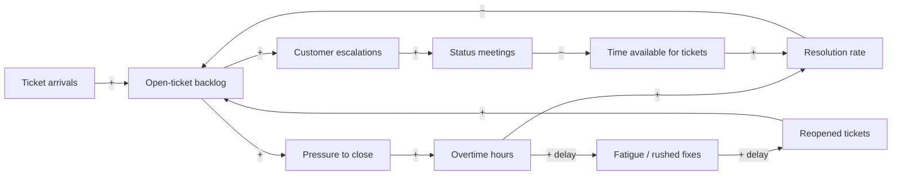

# The systems method: stocks, loops, archetypes, and leverage

Method lineage: system dynamics is Jay Forrester's field; Donella Meadows' *Thinking in Systems*
supplies the stock/flow and leverage-points framing (her essay "Leverage Points: Places to
Intervene in a System" is the canonical ladder — the six-rung form below is a deliberate
simplification of her twelve); the archetypes were popularized by Peter Senge's *The Fifth
Discipline*.

## Contents
- [The stock/flow identification drill](#the-stockflow-identification-drill)
- [Causal-loop drafting protocol](#causal-loop-drafting-protocol)
- [Mermaid conventions for causal-loop diagrams](#mermaid-conventions-for-causal-loop-diagrams)
- [Worked example: the support-ticket backlog spiral](#worked-example-the-support-ticket-backlog-spiral)
- [The archetype field guide](#the-archetype-field-guide)
- [The leverage ladder, with worked intervention choices](#the-leverage-ladder-with-worked-intervention-choices)
- [Policy resistance and what to measure](#policy-resistance-and-what-to-measure)

## The stock/flow identification drill

Run every named quantity in the user's prose through three tests:

1. **The instant test.** Could you measure it in a photograph of the system at one frozen
   moment? Then it is a **stock**. Only measurable over an interval (per day, per month)? Then
   it is a **flow**.
2. **The units test.** Stocks carry plain units (tickets, dollars, people, trust); flows carry
   units *per time* (tickets/day, dollars/month, hires/quarter).
3. **The bathtub test.** For each stock, name the inflow(s) that fill it and the outflow(s) that
   drain it. A stock changes through its flows and through nothing else. If you cannot name the
   flows, you have not understood the stock yet.

Classification examples — this confusion is a whole error class, so drill it:

| Quantity | Kind | Notes |
|---|---|---|
| Bank balance | Stock | measurable at an instant |
| A payment run | Flow | drains the balance; dollars per run/day |
| Open-ticket backlog | Stock | fed by arrivals, drained by resolutions |
| Ticket arrivals / resolutions | Flows | tickets per day |
| Headcount | Stock | fed by hires, drained by departures |
| Hiring | Flow | people per quarter |
| Debt | Stock | the deficit (a flow) feeds it |
| Revenue | Flow | it fills cash (a stock); the two are routinely conflated |
| Customer trust, staff fatigue | Stocks | slow to fill, slow to drain — they carry the delays |

The payoff of the drill: a target set on a stock ("halve the backlog") without naming which flow
will move it is a wish. And a stock keeps rising as long as inflow exceeds outflow — "resolutions
are up 20%" coexists happily with a growing backlog when arrivals are up 30%.

## Causal-loop drafting protocol

The assistant does this labor from the user's prose; the human corrects the result.

1. **Extract causal claims.** Every "X drives Y," "when A rises, B falls," "we respond to P by
   doing Q" in the prose becomes a candidate link. Keep the user's own nouns as node names.
2. **Sign each link.** `+` — the variables move in the same direction (more X → more Y; less X →
   less Y). `−` — opposite directions (more X → less Y). Sign the link for the *direct* effect
   only; indirect effects are what the rest of the diagram is for.
3. **Close the loops.** Follow chains until they return to their origin. Unclosed chains are
   fine (external drivers), but the recurring behavior lives in the closed loops.
4. **Determine loop polarity.** Count the `−` links around the loop: even (or zero) →
   **reinforcing (R)**, amplifies whatever direction it's moving; odd → **balancing (B)**, seeks
   a level and resists displacement. Label loops R1, B1, … on the diagram.
5. **Mark every delay.** Wherever cause precedes visible effect by long enough that an actor
   might act again before seeing the result, mark the link `(delay)`. Delays are the single most
   consequential annotation on the diagram.
6. **Flag assumption links.** Links the user asserted but that no one has observed get a `?`.
   These are the first candidates for measurement.
7. **Hand the diagram to the human** with the explicit framing: "this is my hypothesis of your
   structure — which links are wrong, and what did I miss?" Iterate.

## Mermaid conventions for causal-loop diagrams

Mermaid has no native causal-loop notation, so this house convention uses a `flowchart` with
labeled edges:

- Edge label `+` = same-direction link; `−` = opposite-direction link.
- Append `(delay)` to the label where the effect lags: `-->|+ delay|`.
- Append `?` for asserted-but-unobserved links.
- Name loops in a short legend under the diagram (Mermaid renders no loop arcs): `R1 — fatigue
  spiral: backlog → overtime → fatigue → reopens → backlog`.
- Keep node names as the user's own words; rename only when correcting a stock/flow confusion.

## Worked example: the support-ticket backlog spiral

User's prose: *"Tickets keep piling up. Every quarter we push the team to close more; they work
overtime and the backlog drops for a while, but rushed fixes get reopened, and a few weeks later
the backlog is worse than before. Meanwhile customers escalate, which triggers status meetings
that eat the team's day."*

**Stocks and flows.** Backlog = stock; arrivals and resolutions = its flows; fatigue = a slow
stock; reopened tickets = a flow that re-feeds the backlog.

Loop legend:
- **B1 — the overtime push** (backlog → pressure → overtime → resolution −→ backlog; one `−`,
  balancing): the fix that "works." It drains the tub — the fast loop of the pair.
- **R1 — the fatigue spiral** (backlog → pressure → overtime → fatigue → reopens → backlog; zero
  `−`, reinforcing): the same push that drains the tub re-fills it later through rushed fixes.
  B1 and R1 sharing the `overtime` node, with R1 slower, is the *fixes-that-fail* signature.
- **R2 — the escalation tax** (backlog → escalations → meetings −→ time available → resolution
  −→ backlog; two `−`, reinforcing): a big backlog steals the very hours that would shrink it.

The delays explain the observed rhythm: B1 responds within days (backlog drops, push declared a
success); R1's fatigue-and-reopen response arrives weeks later, after the push ended — so "we
fixed it" and "it's back, worse" are both accurate reports of the same structure.

## The archetype field guide

One-line signatures for the classic shapes (Senge's *The Fifth Discipline* popularized these):

- **Fixes that fail** — a balancing quick fix and a slower reinforcing side effect share a node;
  relief now, worse later. *Signature:* the fix and the relapse involve the same actor. *First
  question:* what does the fix feed, and on what delay?
- **Shifting the burden** — a symptomatic fix and a fundamental fix compete; the symptomatic one
  is faster, so it wins every time, and the capability for the fundamental fix atrophies (often a
  third, reinforcing dependency loop). *First question:* what would we have to get good at that
  this workaround lets us avoid?
- **Limits to growth** — a reinforcing growth engine coupled to a balancing loop around a
  limiting stock; growth stalls and pushing the engine harder does nothing. *First question:*
  which limit is binding — and can we move *it* instead of the engine?
- **Tragedy of the commons** — many actors each gain individually from drawing on a shared
  stock; total draw exceeds regeneration; everyone loses eventually. *First question:* who can
  see the whole stock, and who governs access to it?
- **Escalation** — two balancing loops, one per party, each reacting to the *other's* last move;
  locally each is defending, globally the pair is a reinforcing spiral. *First question:* what
  would let one side stop responding without feeling exposed?
- **Success to the successful** — resource allocation rewards past winners, which makes them
  future winners, independent of merit; two reinforcing loops sharing one allocator. *First
  question:* is the allocation rule measuring performance or just accumulated advantage?

A matched archetype imports both the trap and the known escape route — but the match is a
hypothesis too; check that the loops it predicts are actually present in the drawn diagram.

## The leverage ladder, with worked intervention choices

Simplified from Meadows' twelve leverage points into six rungs, weakest to strongest. State the
rung of every candidate fix.

1. **Parameters** — numbers on existing links: quotas, staffing increments, thresholds.
2. **Buffers** — the size of stabilizing stocks: surge capacity, queues, reserves.
3. **Feedback loops** — strengthening or weakening a loop, or shortening its delay.
4. **Information flows** — who sees what, how fast; making an invisible consequence visible to
   the actor who causes it.
5. **Rules** — what is permitted, required, or forbidden; incentives; definitions of done.
6. **Goals** — what the system is *for*; every lower rung re-aims when the goal changes.

Why higher rungs beat parameter-tuning: the loops that produced the old number are still there
after you change a parameter, and they compensate — the system drifts back. Changing what a loop
sees, what the rules allow, or what the goal is changes what *all* the parameters below do.

Worked before/after on the ticket example:

| Rung | Candidate intervention | Expected system response |
|---|---|---|
| Parameter | Raise the daily closure quota | B1 works harder; R1 (fatigue → reopens) compensates within weeks — the before state, already tried |
| Buffer | Cross-trained surge pool for arrival spikes | Absorbs spikes; does nothing about R1; useful, not curative |
| Feedback loop | Cap overtime (weakens R1's driver); dedicate escalation-handling so meetings stop taxing resolution time (cuts R2) | Slower drain short-term, but the re-fill loop loses its fuel |
| Information | Per-fix reopen rate visible to the resolver and the lead | R1 ran on invisibility; the loop's driver is now seen by the actor who feeds it |
| Rule | A reopened ticket returns to its original resolver; "done" includes verification | Rushing stops paying; the incentive that powered R1 reverses |
| Goal | "Close tickets fast" → "resolve issues once" | Every rung below re-aims: quotas, dashboards, and definitions all inherit the new goal |

The strongest package here is information + rule (make reopens visible, make them return to
sender) — cheaper than the parameter fix that was already failing, because it targets the loop
that actually dominates.

## Policy resistance and what to measure

**Policy resistance.** A stock's current level is usually *held* there by actors' goals, not
stuck there by accident. Push it, and the actors whose goals the old level served will
compensate — more effort on both sides, level barely moved. Before intervening, ask: whose goal
does the current level serve? Who compensates when we push, and through which loop? If the
answer is "several actors, strongly," the intervention must change their goals or information
(higher rungs), not just push harder against them.

**Measurement plan.** For each intervention, record in advance:
- both flow rates separately (arrivals *and* resolutions — never just the stock);
- the stock's trajectory (level over time, not a point reading);
- the key delay's length (e.g., push-to-reopen lag), since shortening a delay is itself a fix;
- one loop-specific tell chosen from the diagram (reopen rate for fixes-that-fail; the limiting
  stock's level for limits-to-growth; both parties' actions for escalation).

Then say what result would *falsify* the diagram, and route the quantitative test to
`data-analytics-bi-skills:statistical-inference` (or exploratory analysis first). A causal-loop
diagram that no measurement could contradict is decoration, not a hypothesis.
