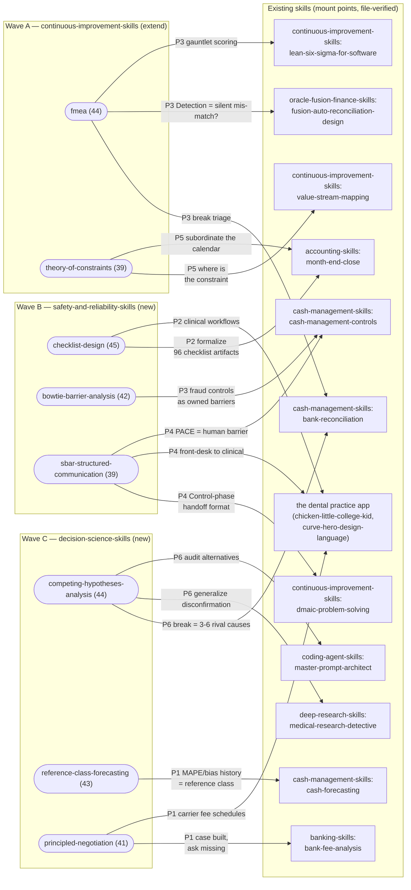

# KSA Synergy Map — top-tier candidates × existing skills

Companion to [cross-industry-ksa-study.md](cross-industry-ksa-study.md). Eight top-tier
candidates (rounded boxes, grouped by proposed build wave) and the existing skills they
mount onto (rectangles). Edge labels name the combination pattern from the study's §4.

Reading the map: the densest mount points are `bank-reconciliation`, `month-end-close`,
`cash-management-controls`, and the dental app — the user's daily surfaces. Tier-2
candidates (pre-mortem, evolutionary-operation, measurement-systems-analysis,
design-of-experiments, tabletop-wargaming, qfd, after-action-review, and others) are
tabled in the study's §6 and omitted here for legibility.
