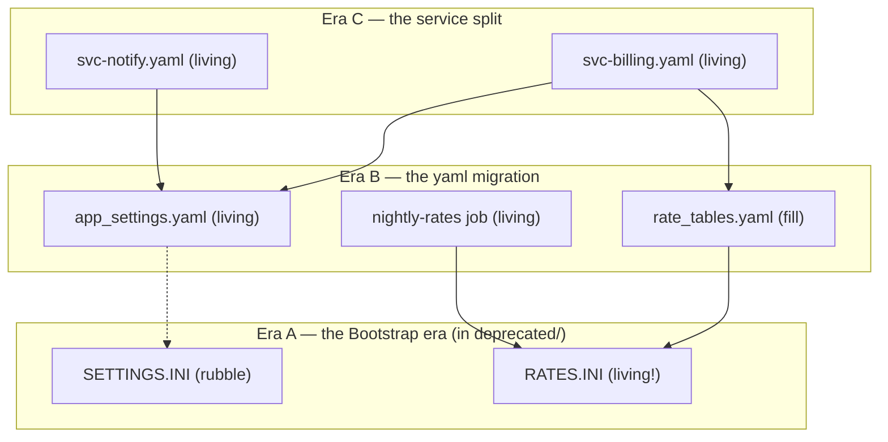

# The excavation method

Method lineage: Edward Harris's stratigraphic recording (the Harris matrix, devised 1973,
formalized in *Principles of Archaeological Stratigraphy*) and its laws, notably
superposition `[snippet-only]`; Reinhard, "Adapting the Harris Matrix for Software
Stratigraphy," *Advances in Archaeological Practice* (Cambridge) — the peer-reviewed
transfer treating a program's version layers as a digital site `[snippet-only]`; Hunt &
Thomas, "Software Archaeology," *IEEE Software* 19(2), 2002 — preserve artifacts, record as
you dig, respect the cultural forces that produced the code `[snippet-only]`.

## Contents
- [Dating-evidence taxonomy](#dating-evidence-taxonomy)
- [Harris-matrix drafting protocol (Mermaid conventions)](#harris-matrix-drafting-protocol-mermaid-conventions)
- [Worked example: a config directory with three eras](#worked-example-a-config-directory-with-three-eras)
- [Era clustering](#era-clustering)
- [Layer classification with evidence bars](#layer-classification-with-evidence-bars)
- [The scream-test protocol](#the-scream-test-protocol)
- [The site-report template](#the-site-report-template)

## Dating-evidence taxonomy

Date every artifact by **convergence of independent lines** — each line alone can lie.
Strongest first:

| Evidence line | What it tells you | How it lies |
|---|---|---|
| Version-control history | First commit, last meaningful change, author clusters, what changed together | Repo migrations flatten history; vendored imports arrive in one bulk commit |
| Dependency direction | Who references whom — the superposition skeleton | Dead references linger; dynamic/string-built references hide |
| Naming-convention eras | Deposition period: each convention regime is a stratum | Renames re-stratify old content; partial migrations mix eras in one directory |
| Style/toolchain fingerprints | Framework idioms, API generations, formatter signatures, comment dialects | A style-reformat commit repaints every stratum at once |
| Author clusters | Which team/contractor/generation deposited it | Bulk moves and bot commits masquerade as authorship |
| Runtime evidence | Logs, access records, execution counts — *life*, not just age | Retention windows shorter than usage rhythms miss slow consumers |
| Filesystem timestamps | Weakest — last resort | Copies, checkouts, migrations, and backup restores all reset them |

Two practices keep the dating honest:
- **Two-line rule:** no artifact is assigned to an era, and no layer classified, on a
  single evidence line.
- **Contradiction flag:** when lines disagree (old naming, recent runtime hits), record the
  contradiction rather than averaging it — contradictions are usually the interesting
  finds (a "dead" era still inhabited, a young file wearing old clothes).

## Harris-matrix drafting protocol (Mermaid conventions)

**Unit of record:** the artifact at the dig's declared grain (file, rule, table, flag,
job, document). **Relationships**, translated from Harris's three:

- **Above** (later than): A overrides, wraps, consumes, supersedes, or was built against B.
  In stratigraphic terms A was deposited after B and rests on it.
- **Contemporary with:** deposited in the same event or era (same commit burst, same
  convention regime, same author cluster).
- **Cuts:** a later change truncated or replaced part of an older artifact (a partial
  migration, a hotfix carved into an old module) — record the cut; it is dating gold,
  because the cutter is always later than the cut.

**Mermaid conventions** (so every matrix in your site reports reads the same way):

- `flowchart TB`, newest strata at the **top** — reading down is reading back in time.
- Solid arrow `A --> B` = "A sits above B" (A is later; A depends on, overrides, or
  supersedes B).
- Dashed arrow `A -.-> B` = relationship suspected but unverified — a hypothesis edge the
  human must confirm or delete.
- One `subgraph` per era, labeled with the era's name and its evidence signature.
- Suffix node labels with classification once assigned: `(living)`, `(fill)`, `(rubble)`.

**Drafting with the assistant (the amplification step).** Feed it the artifact inventory,
the reference/dependency listing, dates, and naming patterns. It emits: the draft matrix,
the proposed era clusters, and a list of its lowest-confidence edges. The human corrects
known-wrong edges and answers the low-confidence list; iterate until no dashed edge
remains on any removal candidate. The draft is a hypothesis — treat unverified edges like
unverified test results, not like facts.

## Worked example: a config directory with three eras

The site: `conf/`, ~200 files accreted over a service's lifetime. Dating evidence found
three convention regimes and one anomaly:

- **Era A — "the Bootstrap era":** `SETTINGS.INI`, `RATES.INI` — ALLCAPS INI files, no
  version-control history before the repo migration, referenced by the oldest module.
- **Era B — "the yaml migration":** `app_settings.yaml`, `rate_tables.yaml` — snake_case
  YAML, one author cluster, a `deprecated/` folder created in the same commit burst to
  hold the Era A files awaiting deletion.
- **Era C — "the service split":** `svc-billing.yaml`, `svc-notify.yaml` — kebab-case
  per-service files, current team's authorship, actively edited.



The find that justifies the whole method: `deprecated/RATES.INI` is **still inhabited** —
the nightly-rates job reads it directly, and Era B's `rate_tables.yaml` (which everyone
believed replaced it) actually *derives from* it. The folder label says dead; superposition
and runtime evidence say living floor. `SETTINGS.INI`, by contrast, has nothing solid above
it — one dashed edge to confirm, then it is a scream-test candidate. Classifying that
folder by its label would have broken billing at the next rate change.

## Era clustering

- Cluster contemporaneous artifacts, then **name the era from its evidence signature** —
  "the Bootstrap era," "the contractor summer," "the compliance push." A name people can
  say out loud turns the dig into shared history instead of a spreadsheet.
- An era boundary requires **two independent evidence lines** (naming shift + author
  cluster; toolchain change + dependency reversal). One line is a hunch.
- Eras are per-site, not per-calendar: a stratum is a deposition regime, and regimes can
  overlap in time across different parts of the site.
- Expect disturbed ground: partial migrations leave Era B content inside Era A files (the
  "cuts" relationship). Record the disturbance instead of forcing the artifact into one era.

## Layer classification with evidence bars

| Class | Meaning | Evidence bar (what you must show) |
|---|---|---|
| LIVING FLOOR | In active use now | Runtime or reference evidence within the artifact's own usage rhythm (a monthly consumer proves life monthly, not daily) |
| FILL | Inert itself, load-bearing for something above | At least one solid (not dashed) edge from a living artifact down onto it |
| RUBBLE | Removable | *All three:* no solid edge from above, no runtime evidence across one full usage cycle, and its era closed (no active deposition in that regime) |

Rules of the bar:
- **Insufficient evidence → FILL.** The default classification is the conservative one;
  RUBBLE must be earned, never assumed.
- **Labels are claims, not evidence** — `deprecated/`, `old/`, `backup/`, `_unused`
  suffixes count for nothing without a confirming line.
- A dashed edge anywhere above an artifact blocks RUBBLE until resolved.
- Reclassification is one-directional on evidence: anything that screams becomes LIVING
  FLOOR immediately; nothing becomes RUBBLE because a window was *almost* silent.

## The scream-test protocol

Provenance: Microsoft's internal decommissioning practice (Inside Track) documents the
method — disable the suspect server, wait, see who screams — and reports that roughly 15%
of servers confidently declared unused screamed when switched off `[snippet-only]`. Uptime
Institute's decommissioning-discipline write-ups document the same wait-and-listen pattern
as standard practice in data-center server roundups `[snippet-only]`. The ~15% is the
measured error rate of "nobody uses this" — the reason the test is run even when everyone
is sure.

1. **Disable reversibly — never delete first.** Flag off, rename, comment out, revoke
   access, stop the schedule. The disable must be undoable in minutes by someone other
   than you.
2. **Announce per policy.** Silent tests catch undocumented consumers (the truth);
   announced tests are politer and fit change-managed environments (the policy). Decide
   per site, in writing, before the first disable.
3. **Size the window to the artifact's usage rhythm** — the window must cover the
   *slowest* plausible consumer:
   - Interactive/daily consumers → 2 weeks minimum.
   - Weekly jobs → 4–6 weeks.
   - Monthly cycles (closes, invoicing, reporting periods) → one full cycle plus margin.
   - Quarterly/annual consumers → either wait the full cycle or substitute targeted
     interviews with the cycle's owners, recorded as evidence in the report.
4. **Assign a listener.** Screams arrive as tickets, failed jobs, or hallway complaints;
   someone must be named to catch and log them, with the rollback steps in hand.
5. **On a scream:** roll back within minutes, record the consumer as a new solid edge in
   the matrix, reclassify the artifact LIVING FLOOR, and thank the screamer — they just
   gave you the evidence nobody had written down.
6. **On silence:** archive the artifact (tag, export, or move to recoverable storage),
   keep a stated recovery window, and only then delete. Deletion without an archive
   converts a cheap mistake into an expensive one.

## The site-report template

```
SITE REPORT — <system>, <date of dig>
Site bounds: <system and strata question>       Grain: <what counted as an artifact>
Inventory: <N artifacts> | Evidence lines used: <which of the taxonomy>

ERAS
<name> — <evidence signature, approximate span, author cluster>

MATRIX
<link to or embed of the Mermaid matrix; note remaining dashed edges>

CLASSIFICATION
<artifact | era | class | evidence lines>   (or link to the table)

REMOVALS
<artifact | disabled how/when | window | announced? | screams (who/what) | outcome>

SURVIVORS
<artifact | why it stays (living/fill) | load-bearing for what>

OPEN QUESTIONS
<unresolved dashed edges, contradictions flagged, next dig>
```

The report is itself a stratum: it records the deposition event you just caused. File it
where the next maintainer of this system will trip over it.
